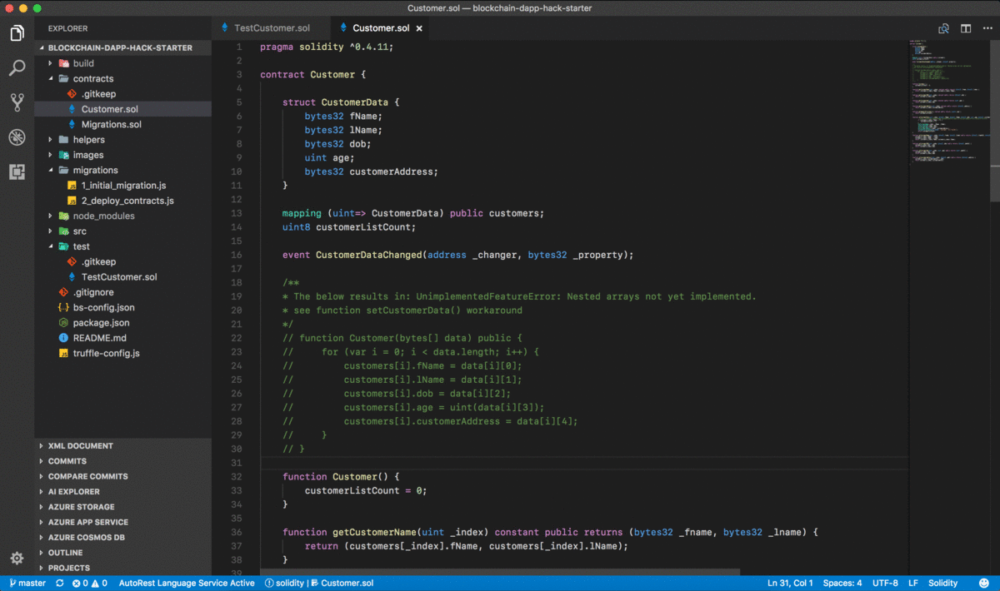
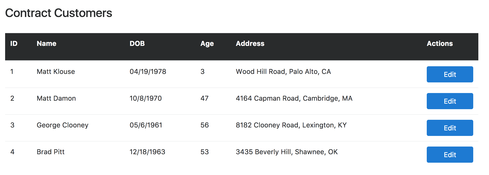
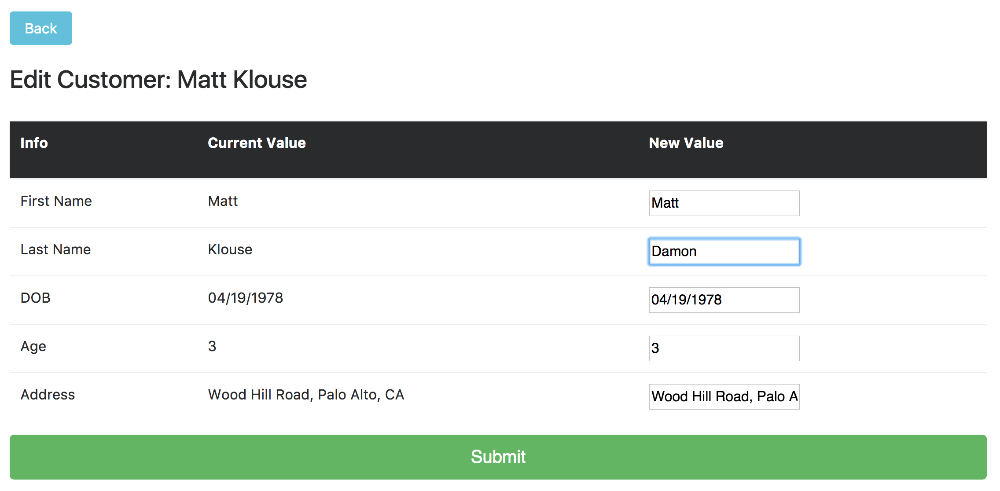
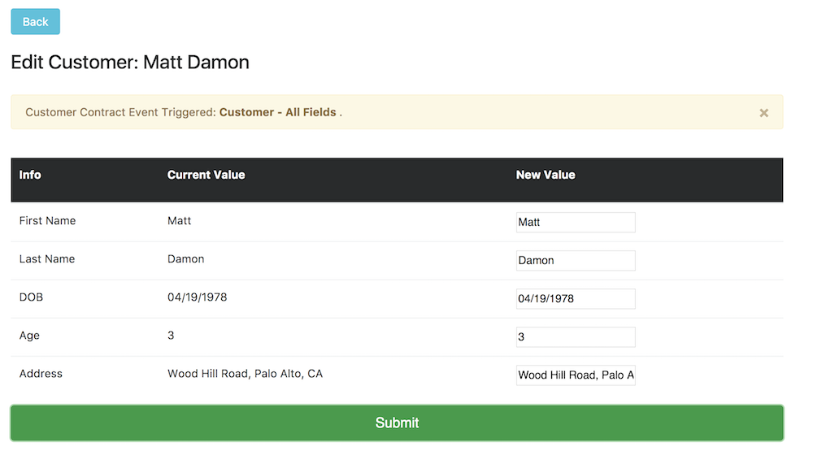

# blockchain-dapp-hack-starter

Template to turbo charge your Blockchain DAPP Development

### ***If you like this project, give it a [](https://github.com/user1m/blockchain-dapp-hack-starter).  If you find issues, [create an issue](https://github.com/user1m/blockchain-dapp-hack-starter/issues).***




## Prerequisites


* Node : tested on `NodeJS v8+`

* **Truffle Version 4+** : **`npm install -g truffle`**

* testrpc : **`npm install -g ethereumjs-testrpc`**


## Installing

Install npm dependencies: 

``` 
> npm install
```

Clean `build` directory:

```
> npm run clean 
```

Run Truffle Console:

```
> npm start 
```
or

```
> truffle develop
```

## Running Tests

```
> npm test
```

Or in the truffle console: `truffle develop`

```
truffle(develop)> test
```

## Running (Migrate & Deploy Contracts)

In the truffle console: `truffle develop`

```
truffle(develop)> migrate --reset --compile-all
```

## Deploy Web App

Another Terminal: 

```
> npm run dev  
```

## Features

#### Template benefits:

- Cross platform (commands should work on windows & linux/mac)
- Useful npm scripts
- Sample example of connecting UI to contract


#### Sample Customer Solidity contract showcases:

- Returning tuples
- Using structs
- Work-around for passing contract data in the constructor


#### Sample Front-end showcases:

- Converting bytes32 contract data back to strings
- Listening for events triggered on the smart contract


## Reading Contract State:



## Changing Contract State:



## Watching Contract Events:




## Built With

* [Truffle](http://truffleframework.com/) - The Ethereum development framework


## Authors

* **Claudius Mbemba** - [User1m](https://github.com/user1m)

## License

This project is licensed under the ISC License